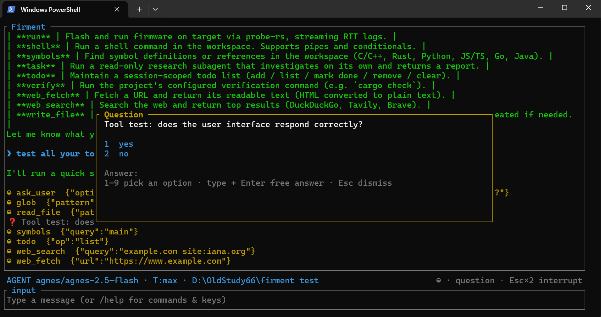
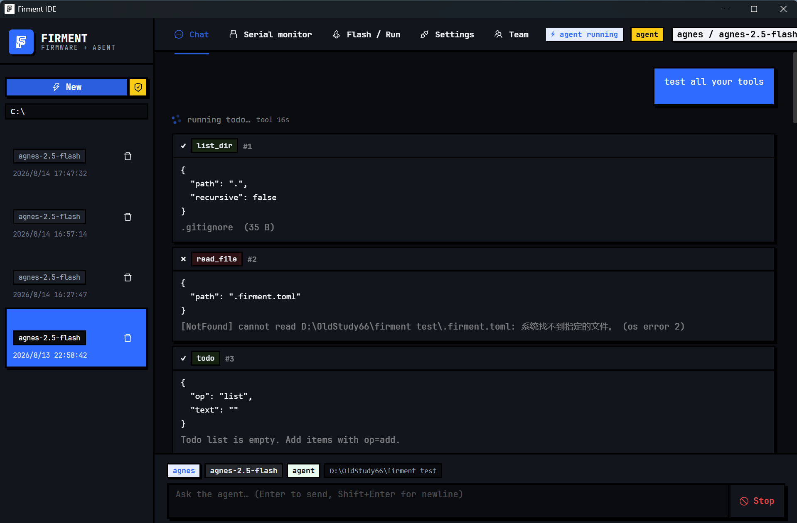
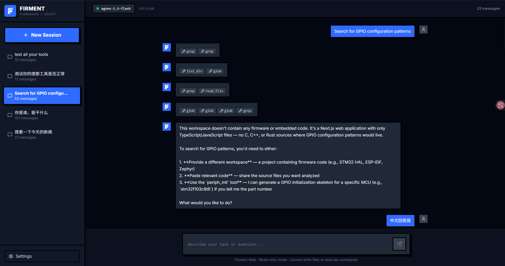

# Firment — Firmware + Agent

[](LICENSE)
[](Cargo.toml)
[](Cargo.toml)
[]()
[](.github/workflows/ci.yml)
[](https://moriv447.github.io/Firment-site/)

[English](README.md) | **简体中文**

<p align="center">
  
</p>

**Firment 是面向固件与嵌入式开发的 AI 工程代理。** 名字取自 *firmament*（苍穹，每个嵌入式工程师头上的那片天），故意少一个 a，把 firmware + agent 融成一个词。它从一句自然语言需求出发，在同一次对话里驱动完整闭环：写代码、用真实工具链编译、通过调试探针烧录、监控串口输出、分析 ELF、在目标行为异常时进行片内调试、用照片和逻辑分析仪波形观测它的物理行为，并在你要求时——红队攻击它刚写出的固件。

内核是一个嵌入式优先的 Rust 编码 Agent。模型把代码打印出来不算"完成"——一次固件改动要真正编译通过、落到目标板上、跑起来，且观测到的输出与预期一致，才算完成；在证据阶梯的最高一级，"观测"意味着照片显示 LED 真的亮了、逻辑分析仪采到的波形测出了正确频率，而不是模型的一面之词。

**一个仓库，三端入口（monorepo）：**

| 端 | 路径 | 技术栈 |
|---|---|---|
| **CLI / TUI** | [`crates/`](crates/) | Rust (ratatui)——核心 Agent |
| **GUI 客户端** | [`gui/`](gui/) | Tauri + React/Vite (TypeScript) |
| **Web** | [`web/`](web/) | Next.js + Tailwind（Vercel 部署）——在线体验：[firment-web.vercel.app](https://firment-web.vercel.app) |

CLI 是事实标准；GUI 客户端共用同一个 Rust Agent 内核（统一的 `Tool` trait 和会话格式），Web 端是 TypeScript 重新实现，通过提交的工具规格快照（`web/src/lib/tools/specs.json`）保持同步。

---

## 🔄 工作方式

很多 AI 编程工具擅长生成源代码，但在嵌入式开发里，"写出一份看起来正确的 `main.c`"通常只完成了很小一部分。一次固件任务，只有在编译通过、烧录成功、运行起来，且观测到的输出符合预期时才算完成：

```text
自然语言需求
      │
      ▼
理解板卡 / 芯片 / 引脚 / 外设
      │
      ▼
生成或修改工程文件
      │
      ▼
编译 ───────────────┐
      │ 成功         │ 失败
      ▼             │
烧录 / 部署         └──► 读编译诊断 ─► 打补丁 ─► 重新编译
      │
      ▼
观测串口 / 寄存器 / 运行时状态
      │
      ├── 证据符合预期 ─► elf_analyze 门禁 ─► 完成
      │
      └── 不符 / 失败 ─► 诊断 ─► 打补丁 ─► 重新烧录 ─► 重新验证
```

Firment 不把模型当 shell 脚本生成器，而是明确分工：

- **模型负责推理**：意图、故障、权衡与下一步行动。
- **工具执行确定性工程操作**：编译、烧录、串口监控、寄存器访问、ELF 分析、片内调试。
- **证据驱动下一步**：只要连接环境能提供可观测结果，就以证据为准。

> **"模型写了固件"不是终点——"固件在真实硬件上验证过"才是。**

---

## ✨ 核心特性

### Agent 内核

- **多提供商**：Anthropic 兼容（`/v1/messages`）与 OpenAI 兼容（`/chat/completions`，覆盖 DeepSeek / GLM / Qwen / Ollama）流式工具调用；DeepSeek V4 自动使用官方 `thinking` + `reasoning_effort`
- **思考级别**：`off / low / medium / high / xhigh / max`
- **内置工具**：`read_file`（带行号分页）、`write_file`、`edit_file`（锚点/行区间/hashline 编辑，回显统一 diff）、`list_dir`、`glob`、`grep`、`shell`、`web_search`（DuckDuckGo / Tavily / Brave）、`web_fetch`、`task`（只读研究子代理）、`todo`、`ask_user`、`hil`、`periph_init`、`elf_analyze`、`monitor`、`debug`、`observe`、`la`、`redteam`
- **只读计划模式**：`--plan` / `/plan` 只暴露只读工具，要求给出可执行的完整计划
- **并行工具调用**：独立调用并发执行；同文件读写与粗粒度工具自动串行
- **工程级系统提示词**：沟通、工程原则、工具策略、验证、安全等分节，支持 `AGENTS.md` / `FIRMENT.md` 项目指令
- **会话管理**：JSONL 持久化、`--continue`、`--list`、交互式 `/sessions` 选择器、变更台账 + `/undo`
- **复制支持**：左键拖选、右键复制、`Ctrl+Shift+C` 复制最后一条回复
- **全局安装**：`firm install` 加入 PATH + 补全；`firm update` 自更新

### 嵌入式工具链

- **`periph_init`** —— MCU 外设初始化骨架 + 知识库 cheatsheet。STM32（F1/F4/G0/**G4**/**H7**）完整 UART/GPIO/I2C/SPI/TIM/ADC HAL 骨架，ESP32/ESP32-S3 指引，CubeMX/PlatformIO HAL 重复警告。内置知识库覆盖真实工程坑：**G4 的 DMAMUX**（没有固定 DMA 通道——F1→G4 迁移经典坑）与 **H7 的 D-Cache 一致性**（DMA TX 前 clean、RX 后 invalidate）
- **`elf_analyze`** —— flash/RAM 占用、函数体积、`-fstack-usage` `.su` 文件的真实栈深度；每次编辑回合后自动重新分析。增长超过配置阈值时，完成会被拦截，直到你批准（headless + `strict` 模式则直到模型修复）；低于阈值的变化默认静默吞掉
- **`monitor`** —— 串口监控，逐行时间戳 + 波特率自动检测；取消回合立即释放串口
- **`la`** —— 逻辑分析仪，经 sigrok-cli 外部二进制（绝不链接进本程序）：有界采集存入 `.firment/la/`，对原始位流做确定性测量（频率只给区间、占空比、边沿计数、脉宽、波特率估算），每个结论带置信度；协议解码直接用 sigrok 自带的解码器（uart / spi / i2c / 1-wire / CAN 等）。HIL `la` 步骤在第 5 级断言 `expect_frequency_hz` / `expect_duty` / `expect_edges` / `expect_decoded`——低置信度测量永远无法通过
- **`hil`** —— 硬件在环套件：一条命令串起 `build → flash → monitor`（带 `expect_contains`/`expect_regex` 断言）`→ elf_analyze`，支持 `.firment/hil.toml` 套件或内联 steps、`dry_run` 模拟、JSONL 回放（`hil replay`）、串口/波特率自动检测与总超时——替代手动串联 build/flash/monitor 的固件验证方式
- **`redteam`** —— 运行时对抗验证：agent 攻击自己写的固件。`.firment/redteam.toml` 声明式套件（与 HIL 同款"一次审批覆盖全程"骨架）：uart 接口 + 合法基线帧、**带种子的确定性变异语料**（boundary / bitflip / oversize / format / delimiter / numeric——同种子同字节序列，漏洞复现只需 `seed + case id`，不依赖大模型）、崩溃哨兵（故障签名 / 启动横幅重现 / 心跳丢失）、预算与目标恢复（重刷/复位——救不活的板子立即中止而非污染后续判定）。漏洞报告必须引用捕获文件，缺证据即封顶 low/UNVERIFIED。可选 LLM 攻击 campaign 在语料之上探索（仅交互会话、目标锁定在套件声明的接口）；headless 实弹需显式 `--live`
- **`build` / `flash` / `run`** —— CMake/Make/Keil 构建命令、probe-rs 烧录（芯片来自 `[tools] default_chip`），全部接入 Agent 循环
- **`debug`** —— 通过探针做完整的片内调试（基于 probe-rs，不依赖 OpenOCD/GDB），Agent 可以自主调试自己写的固件：
  - `analyze` —— 一键故障诊断：暂停目标，读取 PC/LR/SP 与 Cortex-M 故障寄存器（CFSR/HFSR/MMFAR/BFAR），对照固件 ELF 解码 PC/LR（`func+0x12`），并逐项解释置位的故障标志（IACCVIOL / IBUSERR / UNDEFINSTR / FORCED / VECTTBL / STKOF ...）
  - `halt` / `regs` —— 暂停目标并读取完整寄存器表；两次调用之间目标保持暂停，直到烧录、复位或 `debug continue`
  - `mem` / `write` —— 内存读写，地址支持 `0x...` 或 `symbol:name`（从 ELF 符号表解析）；`write` 需要批准
  - `break` / `step` / `continue` —— 设置断点并在命中时上报寄存器、单步、恢复运行
  - `backtrace` —— 暂停并对照固件 ELF 回溯调用栈（基于 DWARF；固件需以 `-g` 构建）
  - `trace` —— 流式采集 SWO/ITM 跟踪包（`probe-rs itm swo`）；probe-rs 自行配置 CoreSight，固件只需写 ITM 端口
  - `forensic` —— 一条命令的 hard fault 验尸：暂停目标、抓取异常帧 + Cortex-M 故障寄存器 + 64 字栈窗，对照 ELF 解码故障点与候选调用链，复读 PC 检测现场是否被破坏（看门狗复位竞态），并将会话变更台账（7 天窗口、最新在前）关联进报告，快照存至会话目录。免审批：现场稍纵即逝

### 验证与证据

固件任务不会仅凭模型"自称完成"就算数——下面的门禁机制做机械性强制，系统提示词则约束模型如实说明自己**实际到达了哪一级证据**：

1. **代码级** —— 文件按预期生成或修改。
2. **构建级** —— 真实编译器/工具链接受了工程。
3. **部署级** —— 固件确实写入了目标。
4. **运行时级** —— 串口输出/寄存器状态符合预期（HIL `expect_*` 断言）。
5. **物理行为级** —— 观测到了真实的外部效果（传感器、探针，或用户明确确认）。

编译成功或烧录成功，**并不自动证明**物理行为正确。三道强制机制兜底：

- **`verify_command` 门禁**：配置的命令（如 `cargo check`）在 Agent 声明完成前必须运行；失败则 Agent 必须继续修改
- **ELF 回归门禁**：每次编辑回合后自动复查 `elf_analyze` 基线——flash/RAM 增长或栈深增长超过阈值即拦截完成
- **HIL 端到端套件**：`hil` 把 build → flash → 观测输出（`expect_contains`/`expect_regex` + `expect_count` 断言）→ ELF 分析串成可重复、可回放的一次性验证，`dry_run` 用于演练
- **`observe` 门（物理层，自动化）**：对目标板的照片做确定性本地 CV——`mode=brightness` 回答"LED 亮没亮 / 亮区在哪"（带自动 ROI 建议）、`mode=motion` 回答"连拍序列里有没有东西动了"、`mode=blink` 回答"闪不闪、多快"（频率只给区间，不给伪精确值）、`mode=diff` 回答"改动前后像素真的变了吗"（before/after 对比）。每个结论都带置信度，HIL 步骤可断言这些结论（`expect_lit`/`expect_motion`/`expect_blink_hz` 等）——**低置信度的答案永远无法通过断言**——第 5 层证据可由 agent 自行验证，且不依赖视觉模型
- **故障签名标记**：捕获的串口/RTT 输出会扫描故障签名（panic、HardFault、BusFault 等），命中即提示 agent 立刻执行 `debug forensic`——抢在看门狗复位毁掉现场之前
- **`la` 门（物理层，自动化）**：波形证据——频率断言只有当目标值落在实测区间内、且估计不是低置信度时才通过；解码出的协议文本（例如总线上真实出现的 UART 字节）同样算物理证据

### SBC 端侧数据平面

把守卫 + 小模型分类跑在局域网单板机（Debian + systemd）上：mosquitto 代理、ollama 小模型、`sbc-guard` 守护进程与 PC 侧 provider 配置。从零到部署的完整手册（含逐项故障排查表）：**[docs/sbc-setup.zh-CN.md](docs/sbc-setup.zh-CN.md)**（英文版 [sbc-setup.md](docs/sbc-setup.md)）。验收只需一条命令：`firm --doctor --sbc`（六段检查，失败即带修复提示）。

### 三端入口，同一个内核

| 端 | 截图 |
|---|---|
| **GUI** —— Tauri + React；工具卡片实时流式（成功/失败红绿），状态徽章显示 `idle Ns` / `tool Nm Ns`；Agent 内核和 CLI 共用同一份 Rust 字节码。项目工作台：会话树、引脚登记、ADR 决策、设备绑定、并行对话 |  |
| **Web** —— Next.js，部署在 Vercel（`firment-web.vercel.app`）；同一套 Agent 内核 + `Tool` trait + tool-spec 快照，浏览器即可用 |  |

---

## 💬 典型会话

```text
你 > PA0 接了一个 LED，在这块 STM32 上做一个 1 kHz PWM 呼吸灯。

Firment > [read_file platformio.ini] → [periph_init tim2_pwm] → [edit_file main.c]
         → [build] ✓ → [flash] ✓ → [monitor] "LED ON" ×2 → [elf_analyze] ✓

你 > 串口没有输出，帮我诊断。

Firment > [debug analyze] → 目标停在 HardFault_Handler，CFSR=IACCVIOL
         → 对照 ELF 解码 PC → 读取故障 PC 处的源码 → 发现野指针
         → [edit_file] → [build] → [flash] → [monitor] "LED ON" ×2 → 完成
```

## 🚀 快速开始

```bash
cargo build --release
./target/release/firm            # 开启新会话
./target/release/firm --continue # 恢复上次会话
```

Windows 一行安装（加入 PATH + PowerShell 补全）：

```powershell
Set-ExecutionPolicy -Scope Process Bypass; iex (irm https://raw.githubusercontent.com/MoRiv447/Firment/main/install.ps1)
```

macOS / Linux：

```bash
curl -fsSL https://raw.githubusercontent.com/MoRiv447/Firment/main/install.sh | sh
```

## ⚙️ 配置

配置文件（首次运行自动生成；Windows 在 `%APPDATA%\firment\config.toml`，其他系统在 `~/.config/firment/config.toml`；`firm config` 可从内置中立供应商目录交互式添加 provider）：

```toml
[provider.default]
base_url = "https://api.deepseek.com/v1"   # OpenAI 兼容端点
model = "deepseek-chat"
api_key_env = "DEEPSEEK_API_KEY"

thinking = "medium"        # off / low / medium / high / xhigh / max
context_budget_chars = 60000
compaction_strategy = "summarize"   # summarize / drop / off

verify_command = "cargo check"        # 声明完成前运行
symbols_backend = "auto"              # auto / ctags / regex
build_command = "cmake --build build" # Keil: uv4 -j0 -b project.uvprojx
default_chip = "stm32f407vetx"        # probe-rs 烧录芯片
monitor_port = "COM3"                 # 串口监控端口
monitor_baud = 115200
web_search = "duckduckgo"       # duckduckgo（免 key）/ bing（免 key，国内可达）/ tavily / brave
elf = "build/fw.elf"                  # 自动建立 elf_analyze 基线

# ELF 门禁完整策略（表格形式；上面的字符串形式使用默认值）：
# [tools.elf]
# glob = "build/fw.elf"
# stack_threshold = 32        # 栈深增长（字节）超过即拦截完成
# flash_threshold_kib = 1     # flash 增长（KiB）超过即拦截完成
# report_benign = false       # 是否把低于阈值的变化交给模型审查（false=吞掉）
# strict = false              # headless/CI：不降级，修到通过才放行
```

项目级配置（仓库内 `.firment/config.toml`）会叠加合并；模型也会被引导阅读 `AGENTS.md` / `FIRMENT.md` 保持自律。

## 📚 硬件知识库（可选）

`periph_init` 使用随附的种子知识库（物化到配置目录）：`vendor-index.toml`（芯片家族 ↔ 参考手册 ↔ cheatsheet 链接）+ `cheatsheets/*.toml`（原创工程经验，已对照参考手册核验）。项目仓库可在 `.firment/` 旁放自己的 `vendor-index.toml`，模型会合并两者。

## 🖥️ CLI

```
firm           开始新会话
firm --continue 恢复上次会话
firm --plan    只读计划模式
firm /sessions 交互式会话选择器
firm install   加入 PATH + 补全
firm update    自更新
firm config    从内置中立目录交互式选择 provider（端点 + key，写入 config.toml）
firm build     运行配置的构建命令
firm flash     通过 probe-rs 烧录固件 ELF
firm run       烧录并运行目标，流式输出 RTT 日志
firm monitor   串口监控，可选 ELF 符号解码
firm hil       运行硬件在环套件（--suite/--steps/--replay/--dry-run）
firm redteam   运行红队攻击套件（--suite/--replay/--list-suites/--dry-run/--live）
firm tools     打印工具注册表 specs（JSON，唯一事实源）
firm --doctor  检查配置与提供商连通性
firm --doctor --sbc
               端到端检查 SBC 端侧模型数据平面：broker 连接、守卫心跳
               新鲜度、模型端点（确认模型已拉取）、绑定的设备。每个失败
               阶段都会输出修复提示。
```

## 🎮 TUI

- 状态栏显示模式、提供商/模型、思考级别、**git 分支 + 工作树变更数**（每 4 秒后台刷新，非 git 仓库自动隐藏）
- 运行中按 `Esc` 两次中断（带 5 秒确认窗口）；空闲时按一次清空输入
- 斜杠命令：`/new`、`/plan [on|off]`、`/agent`、`/models`、`/model <id>`、`/sessions`、`/session <id>`、`/undo`、`/ledger`、`/pin`、`/unpin`、`/provider`、`/add-provider`、`/apikey`、`/thinking`、`/budget`、`/output`、`/copy`、`/context`、`/config`、`/clear`、`/help`、`/quit`——完整命令与快捷键清单见 `/help`
- `Ctrl+P` 打开模型选择器；`↑/↓` 历史/滚动；`PgUp/PgDn` + 滚轮滚动；左键拖选 + 右键复制；`Ctrl+Shift+C` 复制最后回复

## 🔒 安全模型

- **硬件免责声明**：Firment 会对已连接硬件执行真实命令，其产出仍然是需要人来把关的工程工作。在电力电子、电机、加热器、电池或独一无二的原型上动手之前：自行划定电流/电压/转速的边界，保留一条独立的恢复与重烧路径，并且把"编译通过"和"烧录完成"就当作它们本身——它们都不能告诉你设备实际会怎么表现。
- **证据层级**：验证是一个阶梯——(1) 代码、(2) 构建、(3) 部署、(4) 运行时、(5) 物理行为。每一级只有在实际观察到时才算数，通过低一级绝不代表更高一级成立。`build`/`verify` 的输出带 `[evidence: build]` 标签，HIL 套件会报告本次到达的最高层级（`evidence: reached level N (…)`），因此完成汇报陈述的是"证明了什么"而不是"假设了什么"。在电力电子、电机、加热器或电池场景下，物理行为还必须由你自己的独立限位来约束——agent 对电流、扭矩和温度没有直觉。
- **声明**：危险命令防护是尽力而为的启发式（命令名扫描），不是操作系统沙箱。文件工具受路径沙箱约束；`shell` 仅靠权限确认。需要强隔离请在容器/虚拟机里运行 Firment。
- 写/改/shell 默认需要权限确认（TUI 弹窗，`y`/`n`/`a`）；`-y` 依然受危险命令防护约束（`rm/rmdir/del/erase/Remove-Item/mv/ren/git clean/git reset --hard`、强推、`format`、`taskkill`、脚本删除 API、cmd 风格 `%VAR%` 间接调用——除非传 `--allow-dangerous`）
- 计划模式只暴露只读工具；权限层硬拒写/改/shell
- 事务化编辑 + undo 台账；内容寻址编辑（SHA-256）保证同一次编辑只会生效一次；路径沙箱 + spill 配额
- 系统提示词要求如实汇报：准确描述实际执行的命令，绝不在工作区已变更时谎称"已被完全拦截"

## 📦 项目结构

```text
crates/
  firment-core/   Provider 抽象、Agent 循环、会话、配置、权限、Tool trait、系统提示词、KB 种子
  firment-tools/  文件/搜索/shell 工具、危险命令防护、periph_init/elf_analyze/monitor/hil/debug
  firment-tui/    ratatui 终端界面（git 状态栏、模型/会话选择器）
  firment-cli/    clap 入口（bin: firm）+ install/update/补全
gui/              Tauri GUI 客户端（React/Vite + src-tauri）
web/              Next.js 前端（Vercel）
sbc-guard/        SBC 端侧采集器 + 确定性守卫（Python，MQTT + ollama）
docs/             vendor-index.toml + cheatsheets/*.toml（硬件知识库）
.github/workflows/  CI：Rust（fmt/clippy/test）+ web-check + gui-check
```

## 🧪 开发

```powershell
cargo test               # 单元 + 集成测试（4 个 crate）
cargo clippy --all-targets -- -D warnings
cargo fmt --check
# web / gui
cd web && npm ci && npx tsc --noEmit && npm run build
cd gui && npm ci && npx tsc --noEmit && npm run build   # + npm run tauri build 生成安装包
```

## 🗺️ 路线图

- 调试器纵深：断点 halt 处的变量与表达式求值（故障法证已在 v0.7.0 交付）
- 逻辑分析仪二期：Saleae REST 后端、SBC 侧波形节点（`CaptureBackend` 接缝已预留）
- 红队二期：rtt / device_cmd 攻击接口、campaign 发现回填语料的工具链
- TUI 命令面板（模糊查找）
- SWO/trace 更深地接入 Agent 循环
- tree-sitter 结构化编辑与补全
- 基于统一工具注册表的插件 / MCP
- Web 后端：容器化 Rust Agent 支撑 Web 前端
- 技能包：可安装的工具包（声明式外部命令工具 + schema + 提示词）

*（流式 token 动画已在 v0.6.3 落地——时间驱动 spinner、增量合批、换行缓存。）*

## 🤝 贡献

欢迎 Issue 与 PR。请先跑通三个质量门禁（`cargo fmt --check`、`cargo clippy --all-targets -- -D warnings`、`cargo test`）并附上相关测试。

## 📄 许可证

[MIT](LICENSE) © 2026 MoRiv447
